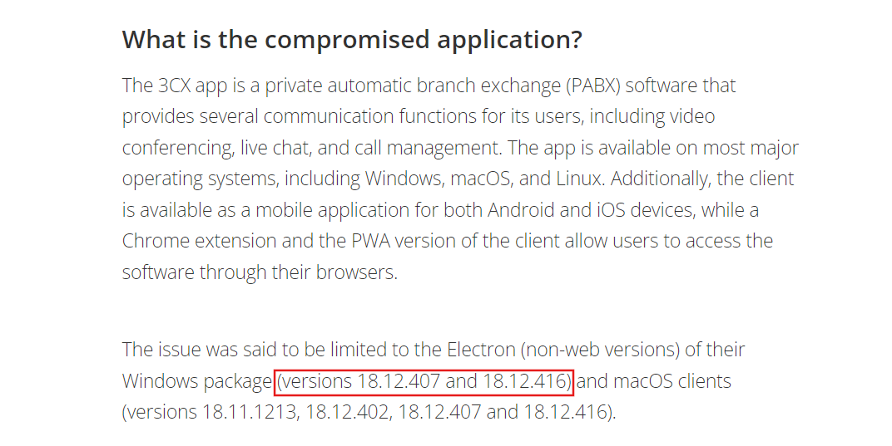
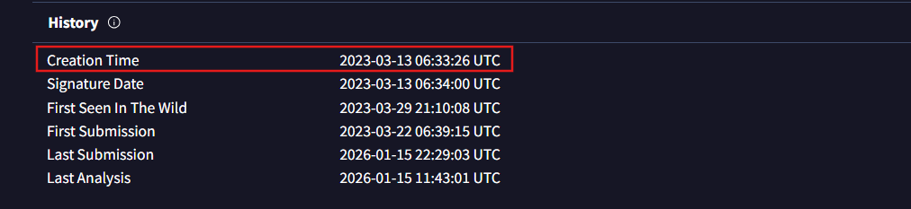
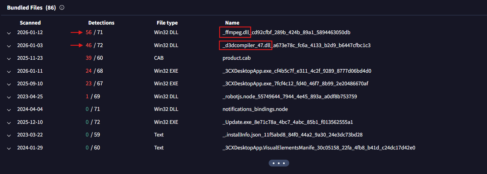
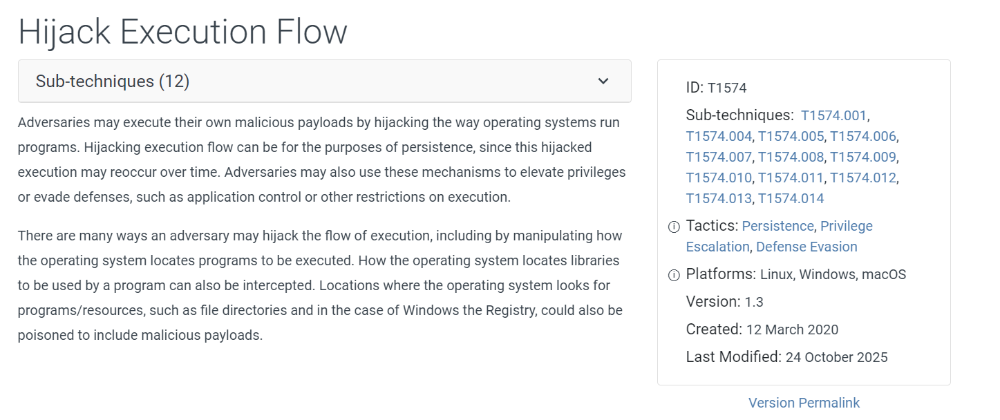
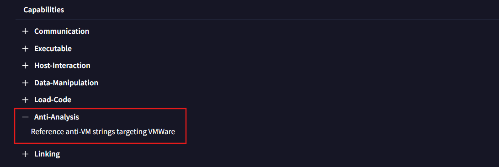
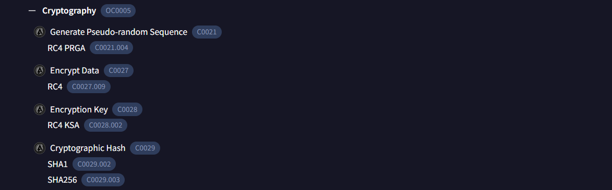
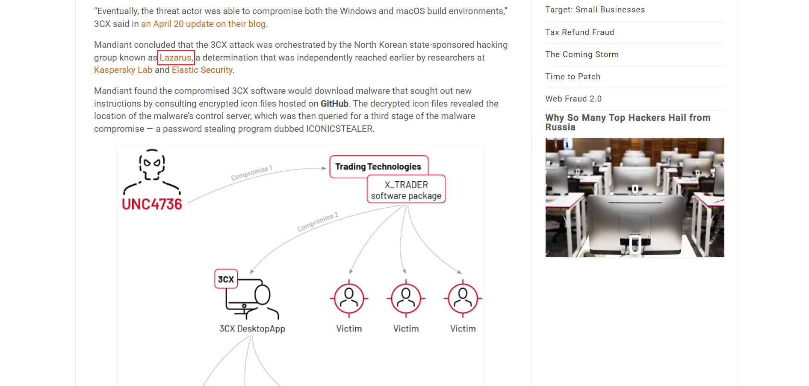

# 3CX Supply Chain

The objectives for this lab are to uncover how the attackers compromised the 3CX app, identify the potential threat actor involved, and assess the overall extent of the incident.

We are given with a Microsft installation package to analyze upon.

### 1. Understanding the scope of the attack and identifying which versions exhibit malicious behavior is crucial for making informed decisions if these compromised versions are present in the organization. How many versions of 3CX running on Windows have been flagged as malware?
We can begin by analyzing publicly available threat intelligence reports, which provide insights into the impacted software versions and IOCs.

(I used the *TrendMicro* report.)

Answer: ***2***

### 2. Determining the age of the malware can help assess the extent of the compromise and track the evolution of malware families and variants. What's the UTC creation time of the .msi malware?
For this question, we will upload the *.msi* file to *VirusTotal* and inspect the details.

Answer: ***2023-03-13 06:33***

### 3. Executable files (.exe) are frequently used as primary or secondary malware payloads, while dynamic link libraries (.dll) often load malicious code or enhance malware functionality. Analyzing files deposited by the Microsoft Software Installer (.msi) is crucial for identifying malicious files and investigating their full potential. Which malicious DLLs were dropped by the .msi file?
Checking the *bundled files* section on the relations tab, we can notice the first 2 files are *.dll* files and infact they have the most number of detections.

Answer: ***ffmpeg.dll,d3dcompiler_47.dll***

### 4. Recognizing the persistence techniques used in this incident is essential for current mitigation strategies and future defense improvements. What is the MITRE Technique ID employed by the .msi files to load the malicious DLL?
*Persistence* is the technique used by attackers to maintain long-term access to a compromised system. It ensures that malicious code or backdoors remain active, enabling threat actors to execute commands, exfiltrate data, or deploy additional payloads.

So, we will explore matching entries for *Persistence* technique in the MITRE ATT&CK table on VirusTotal. 
Checking out the various matching entries, we will take a look at each of their descriptions and try to find which one fits the scenario.

*Hijack Execution Flow* fits best.

It's MITRE definiton states: *Adversaries may hijack the execution flow of a program by placing malicious code in a location where it will be executed instead of legitimate code.* This includes: DLL search order hijacking, DLL side-loading, installer based DLL loading.

Answer: ***T1574***

### 5. Recognizing the malware type (threat category) is essential to your investigation, as it can offer valuable insight into the possible malicious actions you'll be examining. What is the threat category of the two malicious DLLs?
Analyzing each of the DLL files, we can conclude that their threat category is: ***Trojan***.

### 6. As a threat intelligence analyst conducting dynamic analysis, it's vital to understand how malware can evade detection in virtualized environments or analysis systems. This knowledge will help you effectively mitigate or address these evasive tactics. What is the MITRE ID for the virtualization/sandbox evasion techniques used by the two malicious DLLs?
From the *VirusTotal* report of the initial installation package, we can see *Virtualization/Sandbox Evasion* matching entry under the *Defense Evasion* technqiue of the MITRE ATT&CK table.

Answer: ***T1497***

### 7. When conducting malware analysis and reverse engineering, understanding anti-analysis techniques is vital to avoid wasting time. Which hypervisor is targeted by the anti-analysis techniques in the ffmpeg.dll file?
Examining the capabilities of of *ffmpeg.dll* file, we can see that the hypervisor targeted by the anti-analysis technique is VMWare.

Answer: ***VMWare***

### 8. Identifying the cryptographic method used in malware is crucial for understanding the techniques employed to bypass defense mechanisms and execute its functions fully. What encryption algorithm is used by the ffmpeg.dll file?
Under the *Malware Behavior Catalog Tree*, expanding the Cryptography section we can see that *Rivest Cipher 4* encryption algorithm used. It encrypts data by generating a pseudo-random keystream and XORing it with plaintext to produce ciphertext.

Answer: ***RC4***

### 9. As an analyst, you've recognized some TTPs involved in the incident, but identifying the APT group responsible will help you search for their usual TTPs and uncover other potential malicious activities. Which group is responsible for this attack?
To determine the threat actor responsible for this attack, we need to investigate the TTPs and APTs used throughout the incident. 

Reading threat intelligence reports can reveal the group responsible for this attack. (I used the report by *krebsonsecurity*)

Answer: ***Lazarus***
 
 

So, that concludes the lab.

