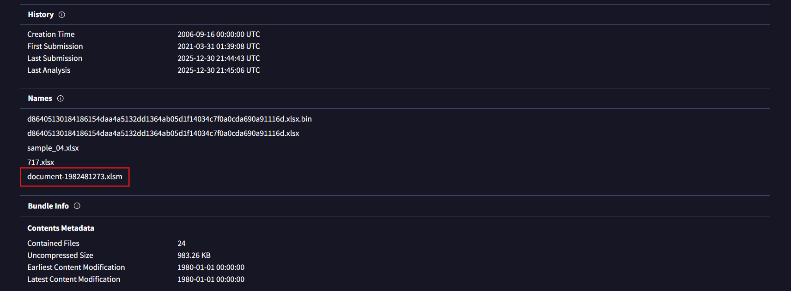
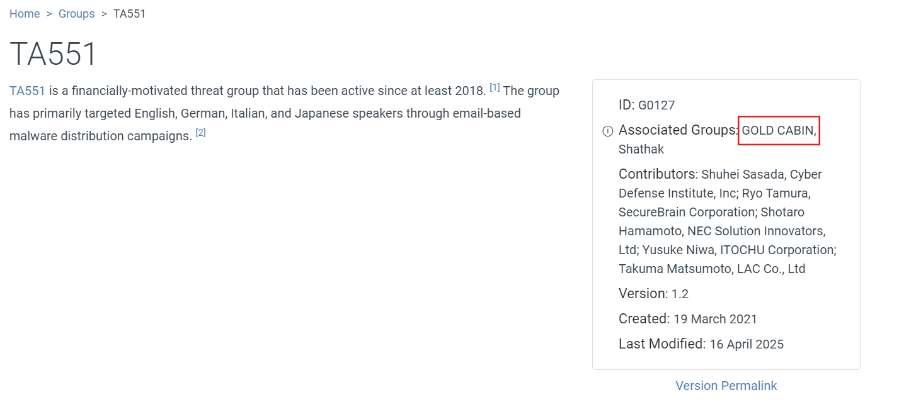
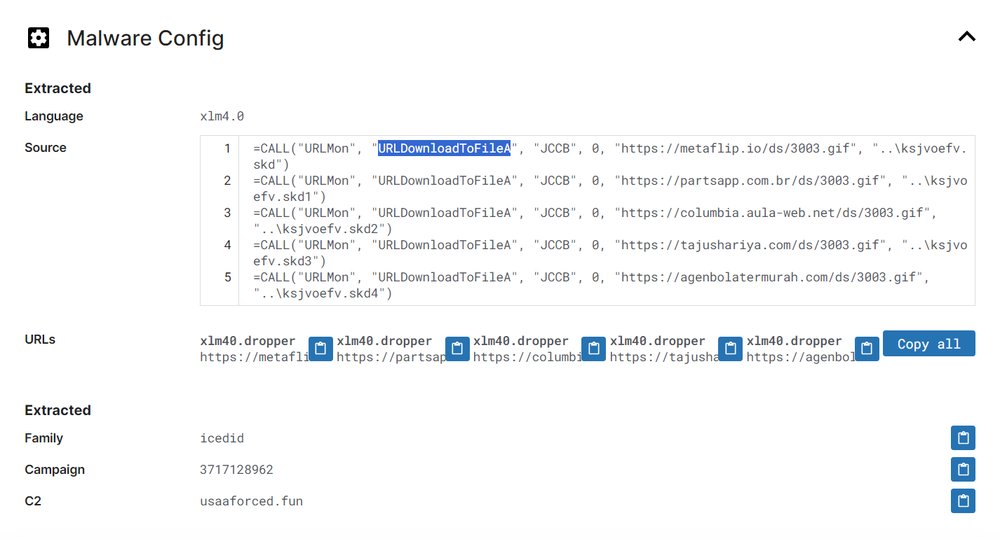

# IcedID Lab

### What is **IcedID**?
It is a particular type of banking malware which was designed to steal financial and other sensitive data from infected Windows systems. 

Its ability to steal credentials, evade detection, and serve as a foothold for further attacks (including ransomware) has kept it relevant in the threat landscape years after its first discovery.

For this lab, we are provided a hash of an IcedID sample to analyze and monitor the activities of this advanced persistent threat group.

### 1. What is the name of the file associated with the given hash?
To answer the first question, we will lookup the hash on *VirusTotal*. After submitting the hash on *VirusTotal* we will then go to the details tab and scrolling down a bit we can find the file associated with the hash.

Answer: ***document-1982481273.xlsm***

### 2. Can you identify the filename of the GIF file that was deployed?
Going to the Relations tab for the hash, under contacted URLs, we can see *3003.gif* associated with a number of URLs. To further verify it, we can scroll down below, and we can see that this gif file also appears under Dropped Files section.

Answer: ***3003.gif***

### 3. How many domains does the malware look to download the additional payload file in Q2?
From the above screenshot, we can see that there are ***5*** domains the malware looks to download the .gif file.

### 4. From the domains mentioned in Q3, a DNS registrar was predominantly used by the threat actor to host their harmful content, enabling the malware's functionality. Can you specify the Registrar INC?
Under the contacted domains tab, we can see that not all domains contacted are malicious. There are many registrars like MarkMonitor, Cloudflare, GANDI, NameCheap, etc. But we can see that NameCheap is tied to a flagged domain. Also, NameCheap is commonly abused by threat actors due to it's low cost and fast registration.

Answer: ***NameCheap***

### 5. Could you specify the threat actor linked to the sample provided?
For this question, we will go the *MITRE ATT&CK*'s website and we will search for *IcedID*.
Now we will look into groups that use this malware and we find that the group **TA551** threat group uses this malware and the associated threat actor is GOLD CABIN.

Answer: ***GOLD CABIN***

### 6. In the Execution phase, what function does the malware employ to fetch extra payloads onto the system?
For this question, we will have a look at the *tria.ge* report provided in the hints.
Analyzing the report, under Malware Config section we can see the API function used by the malware to fetch the payloads. 

The malware uses Excel XLM macro instruction to invoke the Windows API functions.

Answer: ***URLDownloadToFileA***

So, that concludes the lab!