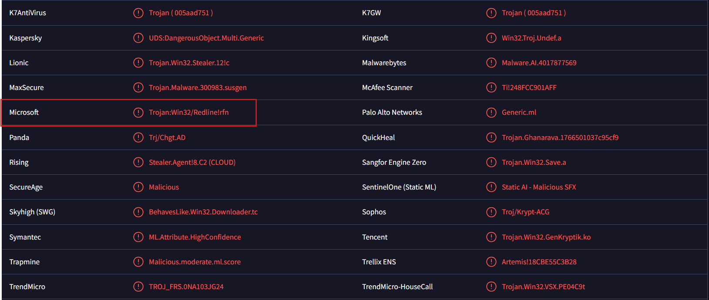
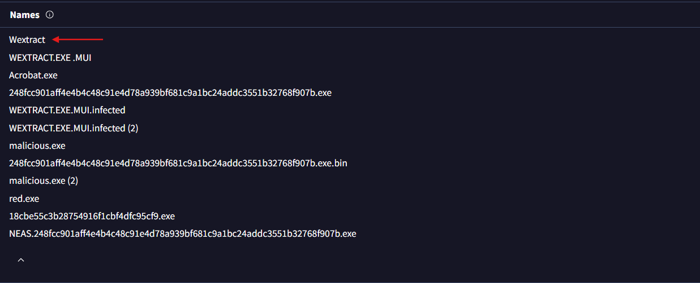
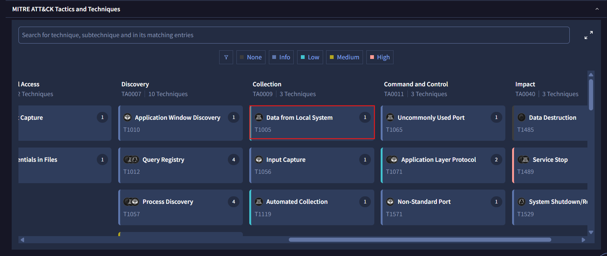
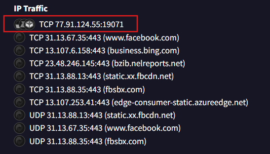
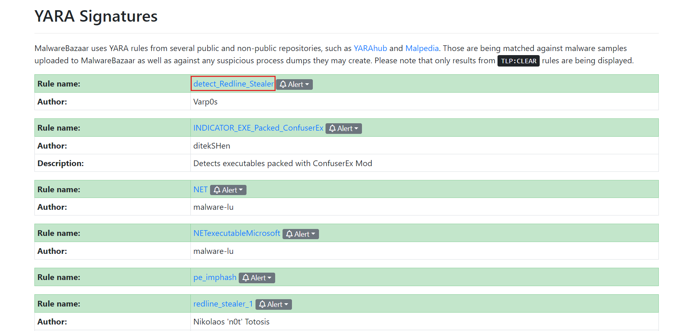
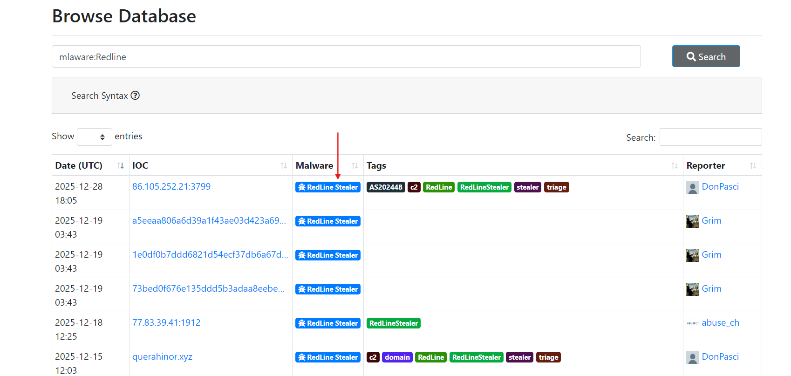
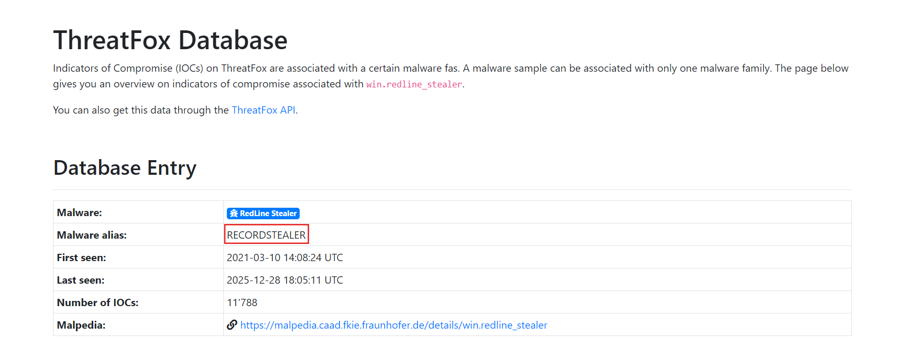
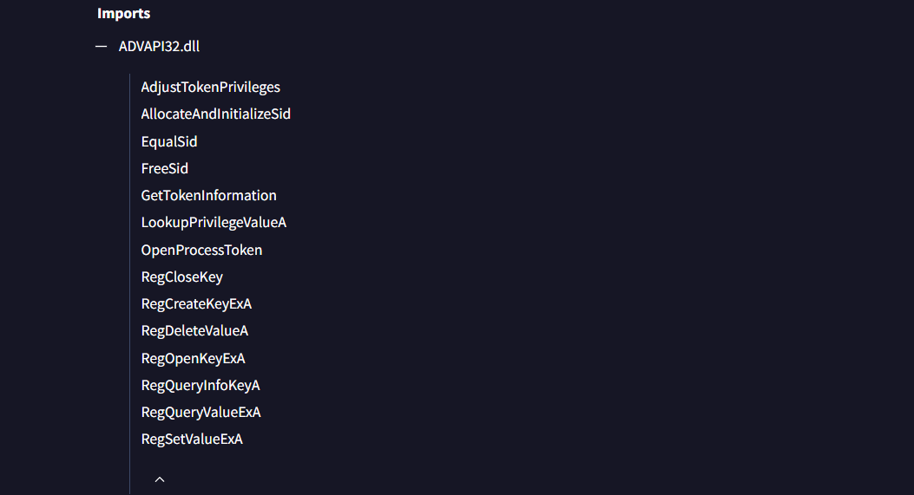

# Red Stealer

### What is ***Red Stealer***?
It is a type of information-stealing malware designed to covertly collect sensitive data from infected systems and exfiltrate it to C2 servers.

In this lab, our task is to gather and analyze useful data from the given file hash.

### 1. Categorizing malware enables a quicker and clearer understanding of its unique behaviors and attack vectors. What category has Microsoft identified for that malware in VirusTotal?
Looking up the hash on *VirusTotal*, under Security Vendor's Analysis, we can find that Microsoft has labelled this malware as **Trojan**.

Answer: ***Trojan***

### 2. Clearly identifying the name of the malware file improves communication among the SOC team. What is the file name associated with this malware?
Moving on to the Details tab, on analyzing we can see the file associated with the malware is **Wextract**.
Certainly there are other files such as *malicious.exe* and *red.exe*, but these files can be deceiving and attackers use this techniques to hide the actual malicious file by naming them legitimately.

Answer: ***Wextract***

### 3. Knowing the exact timestamp of when the malware was first observed can help prioritize response actions. Newly detected malware may require urgent containment and eradication compared to older, well-documented threats. What is the UTC timestamp of the malware's first submission to VirusTotal?
Under the same, Details tab, we can find the timestamp of the malware's first submission.

Answer: ***2023-10-06 04:41***

### 4. Understanding the techniques used by malware helps in strategic security planning. What is the MITRE ATT&CK technique ID for the malware's data collection from the system before exfiltration?
Under the Behaviour tab, from the **MITRE ATT&CK Tactics and Techniques** table, under **Collection**, we can determine the ID for *data from local System* technique.

Answer: ***T1005***

### 5. Following execution, which social media-related domain names did the malware resolve via DNS queries?
Under *DNS Resolutions* on the same Behaviour tab, we can see *facebook.com* being flagged by more vendors.
Also, threat actors often use domains like *facebook.com*, so that it does not raise nay suspicion.

Answer: ***facebook.com***

### 6. Once the malicious IP addresses are identified, network security devices such as firewalls can be configured to block traffic to and from these addresses. Can you provide the IP address and destination port the malware communicates with?
Inspecting the *IP Traffic* and *Memory Pattern IP*, the top IP address stands out as it is flagged by more number of vendors. This means that the malware communicates C2 servers located on *77.91.124.55* using port *19071*.

Answer: ***77.91.124.55:19071***

### 7. YARA rules are designed to identify specific malware patterns and behaviors. Using MalwareBazaar, what's the name of the YARA rule created by "Varp0s" that detects the identified malware?
For this question, we have to browse the *MalwareBazaar* database. We will search the database with the given SHA256 hash. On searching, it comes up with an entry. Exploring it's details, we can find it's YARA signatures and the rule created by *Varp0s*, which is **detect_Redline_Stealer**.

Answer: ***detect_Redline_Stealer***

### 8. Understanding which malware families are targeting the organization helps in strategic security planning for the future and prioritizing resources based on the threat. Can you provide the different malware alias associated with the malicious IP address according to ThreatFox?
Now, we have to use the *ThreatFox* dtabase to find an alias for the malware.
To search, type: `malware:Redline`.

Here, we can see multiple *Redline Stealer* entries. Click anyone of them and we can find the alias, i.e. **RECORDSTEALER**

Answer: ***RECORDSTEALER***

### 9. By identifying the malware's imported DLLs, we can configure security tools to monitor for the loading or unusual usage of these specific DLLs. Can you provide the DLL utilized by the malware for privilege escalation?
Moving back to the *Details* tab on VirusTotal, under imports, we can see a few DLL files imported by the malware. We have to inspect each DLL files but thankfully the first DLL file, i..e ADVAPI32.dll appears suspicious. It's functions enable manipulation of access token which is used for *Privilege Escalation*.

Answer: ***ADVAPI32.dll***

So, that concludes the walkthrough.