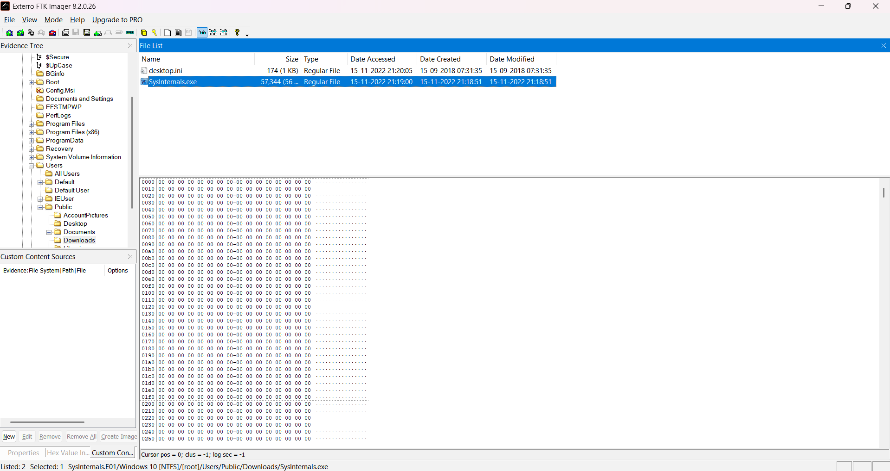
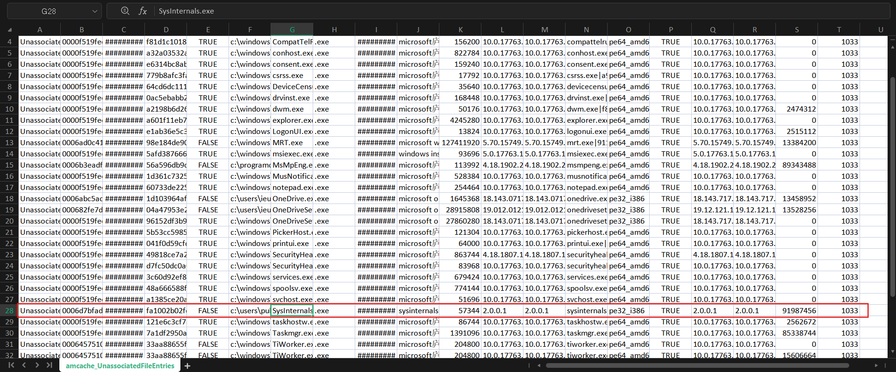
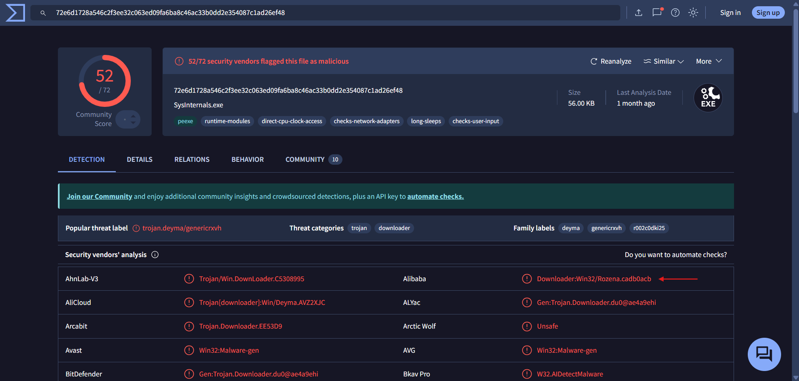
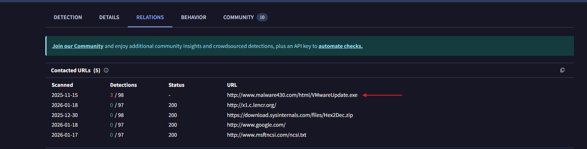
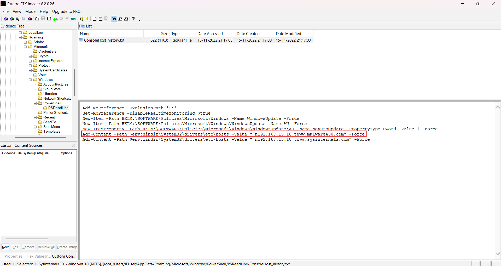
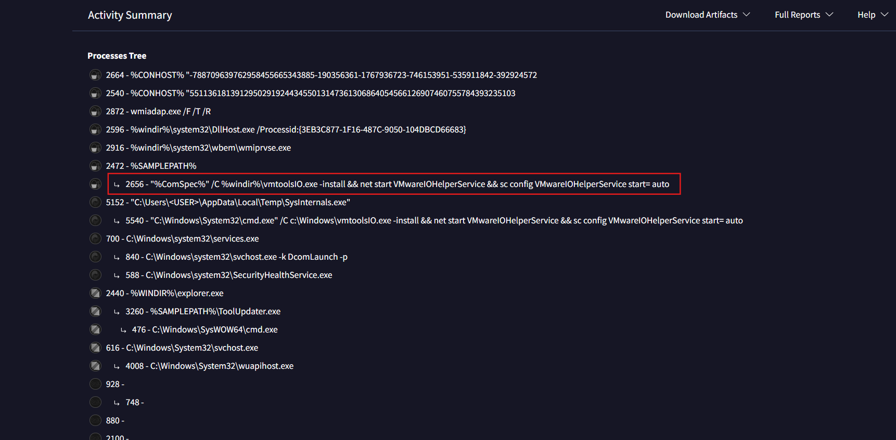
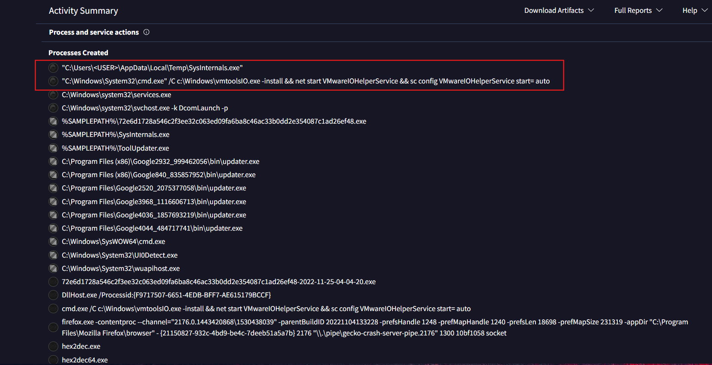

# Sysinternals

Scenario: Conduct endpoint forensic analysis to detect, analyze, and understand malware infections using disk images, registry artifacts, and threat intelligence.

For this lab we will use tools like: FTK Imager, Amache Parser & VirusTotal.

Download the file and open the disk image in FTK Imager (or Autopsy).

### 1. What was the malicious executable file name that the user downloaded?
Navigate to *[root]\Users\Public\Downloads*. We can see 2 files:
1. desktop.ini - It defines how a folder is displayed in File Explorer, including its icon, name, and localized properties. It is not much relevant for our investigation.
2. Sysinternals.exe -It is a Microsoft-maintained collection of Windows diagnostic tools that provide deep visibility into system processes, memory, files, registry activity, and security behavior. But it is not a single file, it is a collection of Windows utilities, each provided as a standalone executable. Additionally, it's size is 56 KB, which is small for such suite. Also, the contents of this executeble consists entirely of zeroes.

So, *SysInternals.exe* is the malicious file, the user downloaded.

Answer: ***SysInternals.exe***

### 2. When was the last time the malicious executable file was modified?
This can be found in the same page.

Answer: ***2022-11-15 21:18***

### 3. What is the SHA1 hash value of the malware?
FTK Imager allows directly to export file hashes. But as we saw that the executable file has it's contents as zeroes, this means the file was tampered and hence the image cannot provide the accurate hash.

So, we will analyze the *Amcache* hive which stores the metadata about the executable files that have been run on the system. To get the hive, we will navigate to *[root]\Windows\appcompat\Programs* and export the *Amcache.hve* file.

Now, to access it's contents, we have to use a tool called *AmcacheParser* by Erik Zimmerman, which parses the registry hive.

To use AmcacheParser, open terminal on where it is located and run the following:

`AmcacheParser.exe -f Hive_Location_Directory --csv Output_Directory`

After running the parser, we are presented with a bunch of CSV files on the specified output location. But our interest is on the *amcache_UnassociatedFileEntries.csv* file as it contains records of executable files observed by Windows that are not associated with a registered application or installer, often indicating standalone or portable executables. (Just like the SysInternals.exe file.)

Opening the CSV file we can see the files with their hashes.

Answer: ***fa1002b02fc5551e075ec44bb4ff9cc13d563dcf***

### 4. Based on the Alibaba vendor, what is the malware's family?
Searching the hash on *VirusTotal* we can determine the malware's family.

Answer: ***Rozena***

### 5. What is the first mapped domain's Fully Qualified Domain Name (FQDN)?
Analyzing the contacted URLs under the relations tab on VirusTotal, we can see the FQDN of the first mapped domain (the one with most number of detections).

Answer: ***www.malware430.com***

### 6. The mapped domain is linked to an IP address. What is that IP address?
As PowerShell is commonly used to modify the hosts file or network settings, and it records executed commands by default, the mapped domain might be recorded in the PowerShell command history.

So, the command history can be found under *[root]\Users\IEUser\AppData\Roaming\Microsoft\Windows\PowerShell\PSReadLine* -> ConsoleHost_history.txt.

And yes, the IP address linked to the mapped domain is present on the text file.

Answer: ***192.168.15.10***

### 7. What is the name of the executable dropped by the first-stage executable?
From the VirusTotal report, going to Behavior -> *Process Tree*, we can notice a couple of suspicious things:

1. vmtoolsIO.exe is not a default Windows binary.
2. It is written to C:\Windows\ (high-privilege location) and is installed as a service (VMwareIOHelperService).

This indicates dropping + persistence.
Therefore, Sysinternals.exe dropped *vmtoolsIO.exe*.

Answer: ***vmtoolsIO.exe***

### 8. What is the name of the service installed by 2nd-stage executable?
Now, going to the *Process and Service Actions* section under the same Behavior tab, we can see logs of service configurations and start events.

Here, we can see the critical commands executed:
1. *vmtoolsIO.exe* -install → installs a service
2. *net start VMwareIOHelperService* → starts the service
3. *sc config VMwareIOHelperService start=auto* → persistence

So, we can confidentally now say that the service installed by 2nd-stage executable is *VMwareIOHelperService*.

Answer: ***VMwareIOHelperService***

 

This concludes the lab.
