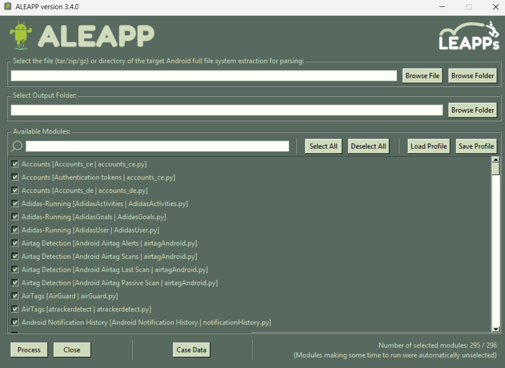
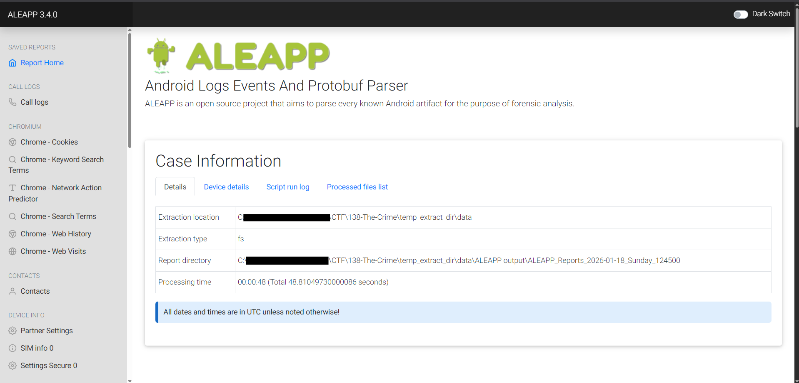
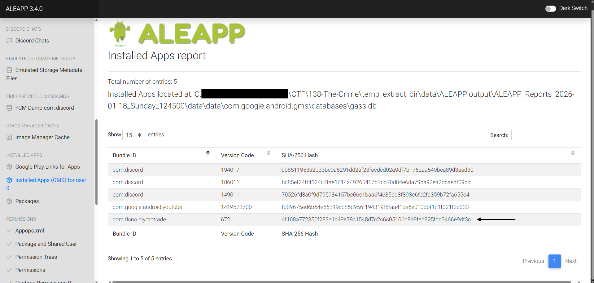
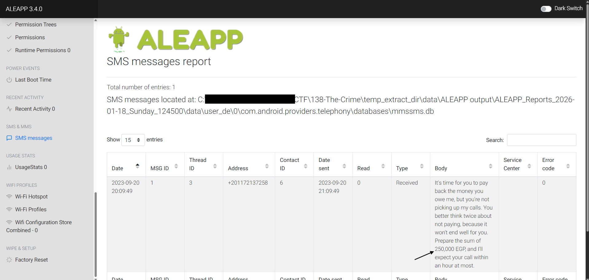
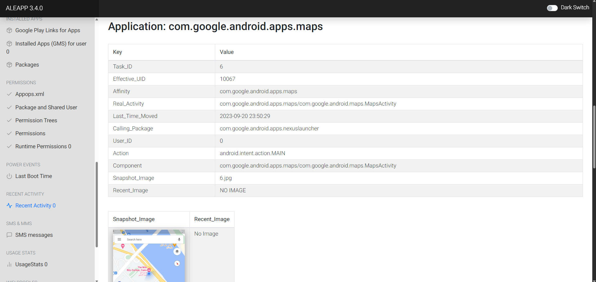
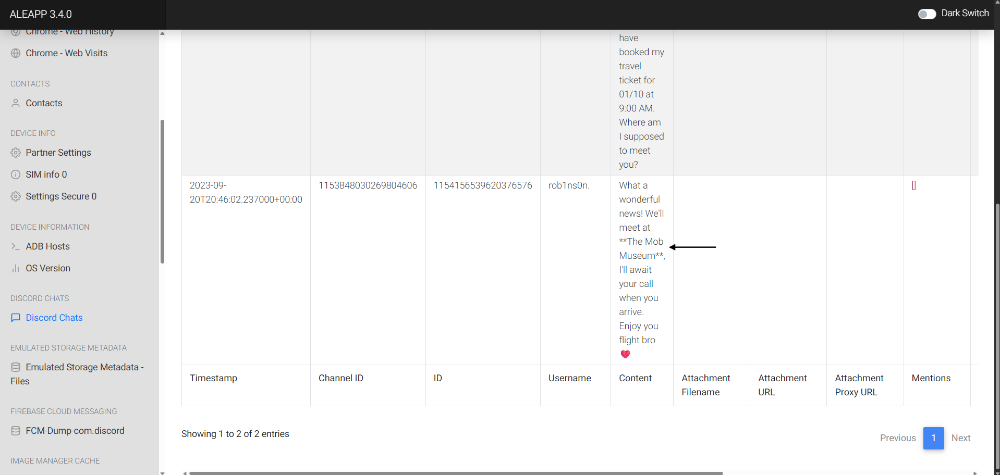

# The Crime

We are given an Android device's artifacts. We have to Utilize **ALEAPP** to analyze the artifacts, reconstructing a victim's financial details, movements, and communication patterns.

What is **ALEAPP**?
It is an open-source Android forensic parser that extracts and presents meaningful artifacts from Android app data and system logs (for this particular lab, I've used the GUI version of ALEAPP).

The ALEAPP GUI looks like this:

So, we will select the *data* folder from the downloaded lab files, then select an output folder and start the process. It will take a few seconds to process and we are presented with an *HTML report* file:

### 1. Based on the accounts of the witnesses and individuals close to the victim, it has become clear that the victim was interested in trading. This has led him to invest all of his money and acquire debt. Can you identify the SHA256 of the trading application the victim primarily used on his phone?
Browsing to the installed apps section, we can find that *OlympTrade* was used.

Answer: ***4f168a772350f283a1c49e78c1548d7c2c6c05106d8b9feb825fdc3466e9df3c***

### 2. According to the testimony of the victim's best friend, he said, "While we were together, my friend got several calls he avoided. He said he owed the caller a lot of money but couldn't repay now". How much does the victim owe this person?
For this question, we will look at the SMS Messages report. Reading the SMS body of the first entry, we can determine the amount of money the victim owes.

Answer: ***250000***

### 3. What is the name of the person to whom the victim owes money?
Analyzing the SMS Messages report, we can note the phone address of the sender, and then search it in the Contacts report.

Answer: ***Shady Wahab***

### 4. Based on the statement from the victim's family, they said that on September 20, 2023, he departed from his residence without informing anyone of his destination. Where was the victim located at that moment?
Inspecting the Recent Activities, we can see that the victim used *Google Maps* and there is a snapshot of the map attached to it. The snapshot has the location of the victim.

Answer: ***The Nile Ritz-Carlton***

### 5. The detective continued his investigation by questioning the hotel lobby. She informed him that the victim had reserved the room for 10 days and had a flight scheduled thereafter. The investigator believes that the victim may have stored his ticket information on his phone. Look for where the victim intended to travel.
The victim might have downloaded the ticket on their device. So, navigating to *\data\media\0\Download* directory (from the original downloaded lab file), we can see the plane ticket.

Answer: ***Las Vegas***

### 6. After examining the victim's Discord conversations, we discovered he had arranged to meet a friend at a specific location. Can you determine where this meeting was supposed to occur?
Analyzing the Discord Chats report, we can find the specific location where the meeting was supposed to occur.

Answer: ***The Mob Museum***

 
This concludes the lab.