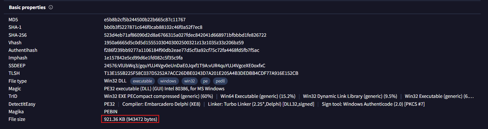
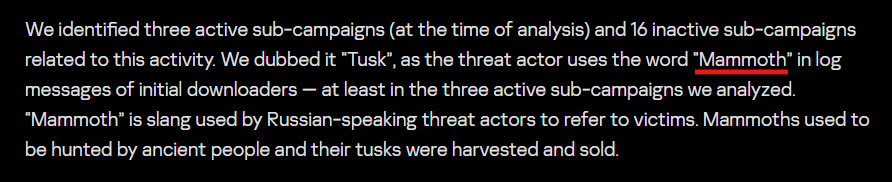
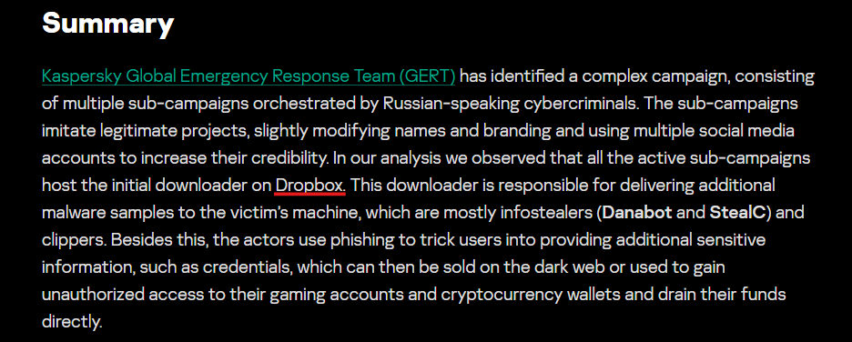
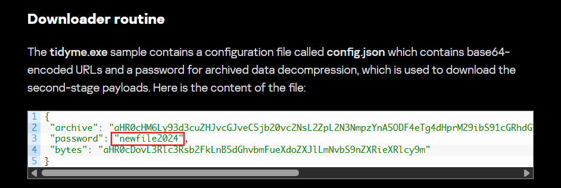
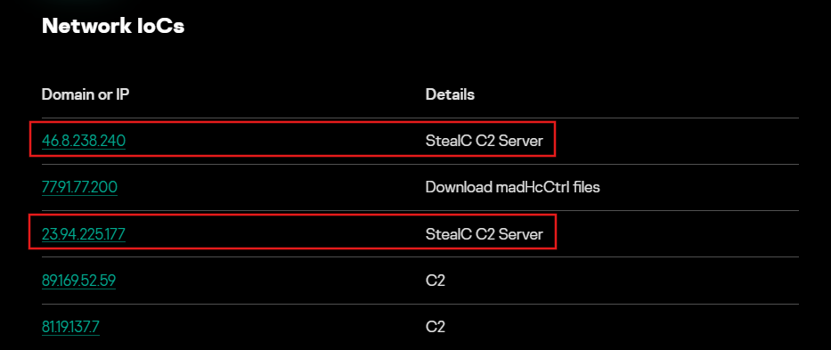
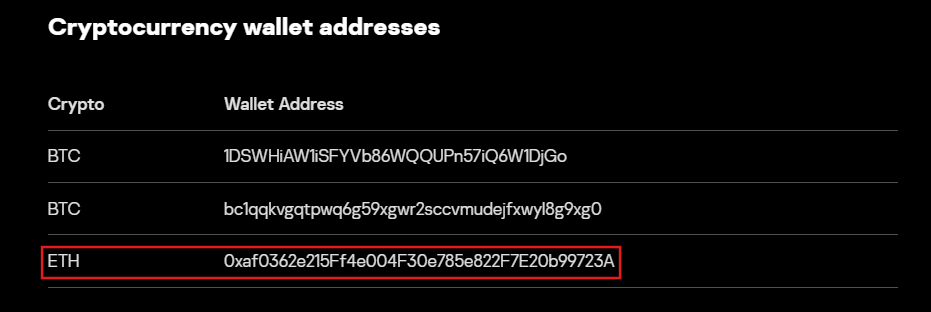

# Tusk Infostealer

### Given Scenario
A blockchain development company detected unusual activity when an employee was redirected to an unfamiliar website while accessing a DAO management platform. Soon after, multiple cryptocurrency wallets linked to the organization were drained. Investigators suspect a malicious tool was used to steal credentials and exfiltrate funds.

Our task is to analyze the provided intelligence to uncover the attack methods, identify indicators of compromise, and track the threat actor’s infrastructure.

### What is Tusk?
It is a credential stealing malware designed to sliently harvest sensitive data from infected systems and send it to attackers.

For this task, we need tools and sources like *VirusTotal* and threat intelligence reports like *Kaspersky Threat Intelligence Portal* and *SecureList* reports.

### 1. In KB, what is the size of the malicious file?
For this question, we will look up the given hash on *VirusTotal*. Then going to the details tab, we can see the file size.

Answer: ***921.36*** KB

(From the next question onwards, we will be browsing the Kaspersky's report of Tusk on *SecureList*.)

### 2. What word do the threat actors use in log messages to describe their victims, based on the name of an ancient hunted creature?
Reading the summary of the report, we can find the word that the threat actors use in log messages to refer to their victims.

Answer: ***Mammoth***

### 3. The threat actor set up a malicious website to mimic a platform designed for creating and managing decentralized autonomous organizations (DAOs) on the MultiversX blockchain (peerme.io). What is the name of the malicious website the attacker created to simulate this platform?
Under the *First Sub-Campaign* section, we can find the malicious website to be ***tidyme.io***.

### 4. Which cloud storage service did the campaign operators use to host malware samples for both macOS and Windows OS versions?
The cloud storage service can be found under the same *First Sub-Campaign* section or if you remember, it was also mentioned on the summary at the starting of the report.

### 5. The malicious executable contains a configuration file that includes base64-encoded URLs and a password used for archived data decompression, enabling the download of second-stage payloads. What is the password for decompression found in this configuration file?
For this question we will check the snippet provided under the *Downloader routine* subsection.

Answer: ***newfile2024***

### 6. What is the name of the function responsible for retrieving the field archive from the configuration file?
Just below the file content snippet, we can see the function responsible for retrieving the filed archive from the config file, i.e., ***downloadAndExtractArchive***.

### 7. In the third sub-campaign carried out by the operators, the attacker mimicked an AI translator project. What is the name of the legitimate translator, and what is the name of the malicious translator created by the attackers?
The first line of the *Third Sub-Campaign* section reveals the answer.

Answer: ***yous.ai, voico.io***

### 8. The downloader is tasked with delivering additional malware samples to the victim’s machine, primarily infostealers like StealC and Danabot. What are the IP addresses of the StealC C2 servers used in the campaign?
The IP addresses can be found in the *Netowrk IoCs* section after the conclusion of the report.

Answer: ***46.8.238.240,23.94.225.177***

### 9. What is the address of the Ethereum cryptocurrency wallet used in this campaign?
At the end of *IoC* section, we can find the *cryptocurrency wallet addresses*.

Answer: ***0xaf0362e215Ff4e004F30e785e822F7E20b99723A***

So, this ends the lab!