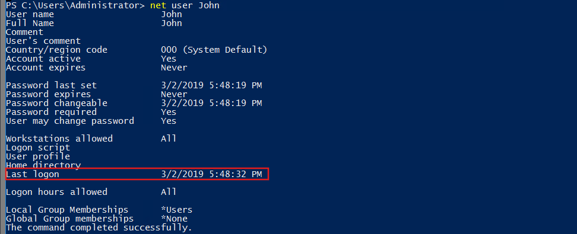
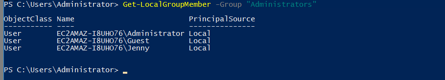
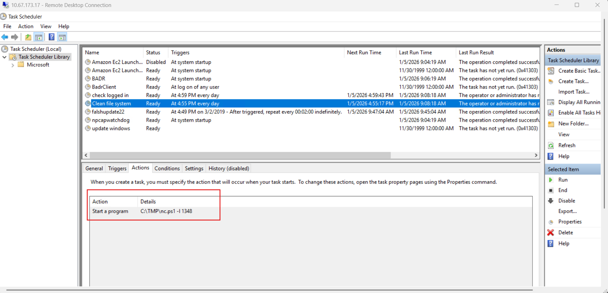
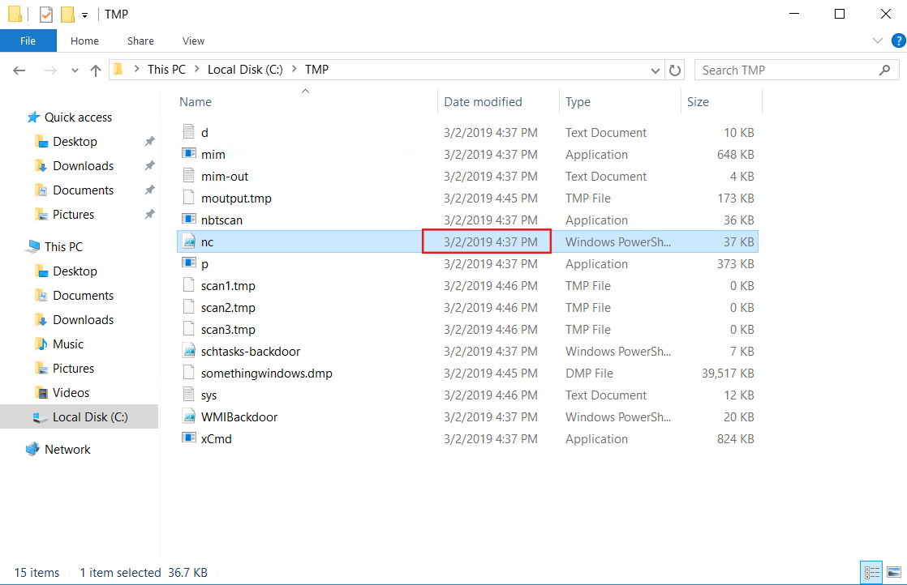
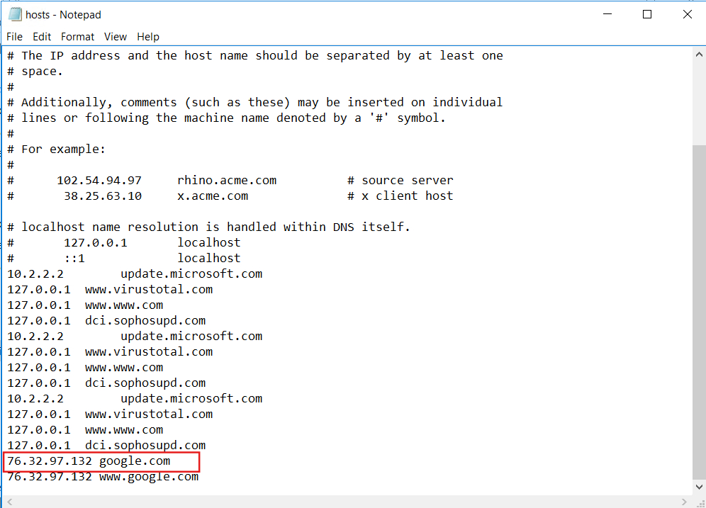
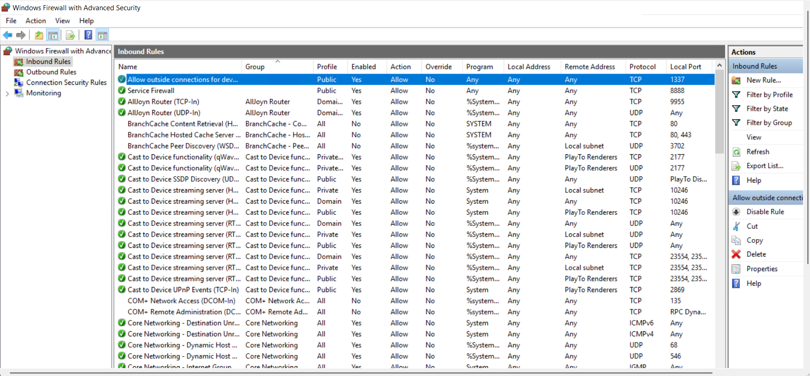
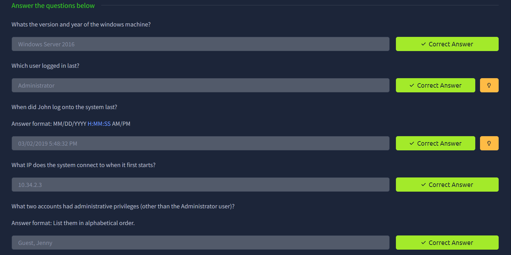
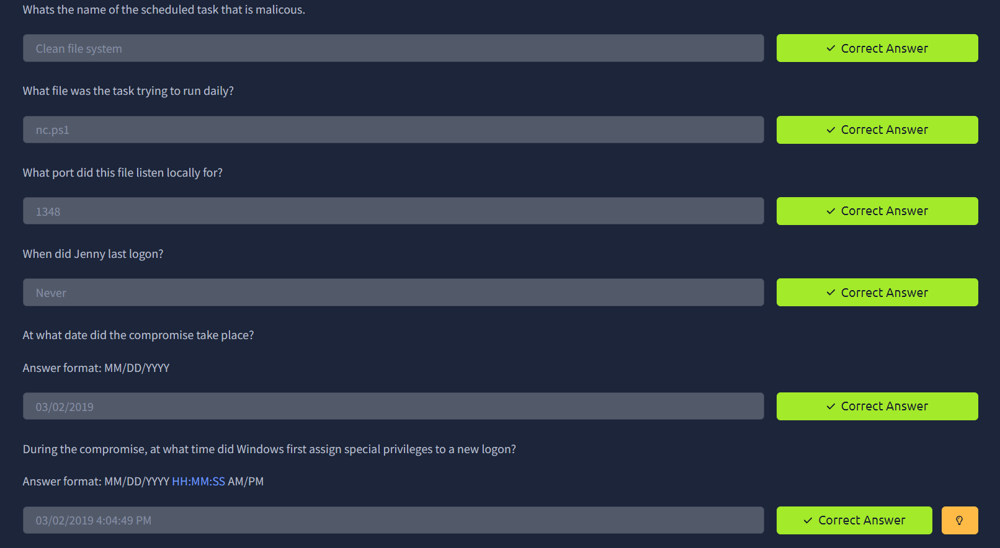
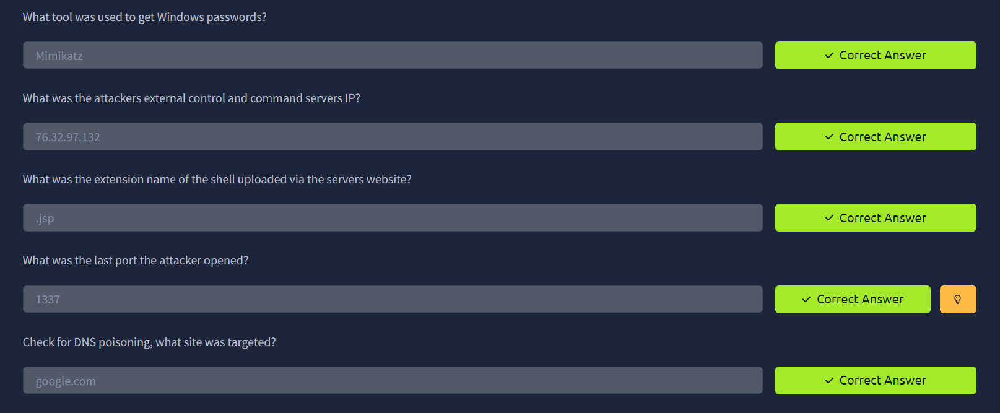

# Investigating Windows

First, start the machine and wait for the the attackbox to start. If using VM, make sure you have your correct OpenVPN config file and connect to it.

After connecting use *Remote Desktop Connection* application on Windows or we can use *xrdp* for Linux, and then connect with the given credentials: *username: Administrator*, *password: letmein123!*.

After successfully connecting, we will be presented with a windows desktop screen. We can notice that cmd opens for a few seconds and tries to connect to an IP address. Take a note of this IP as we will need this later, which will make our task easier.

### 1. Whats the version and year of the windows machine?
Open *windows powershell* and run `systeminfo`. We can see the OS version to be ***WIndows Server 2016***.

### 2. Which user logged in last?
As we remotely logged in as administrator, we were the last user to log on. So, the answer is: ***Administrator***.

### 3. When did John log onto the system last?
On running `net user John` on the powershell, we can see details about the user John.

So, the answer will be: ***03/02/2019 5:48:32 PM***.

### 4. What IP does the system connect to when it first starts?
Do you remeber the IP that the system tries to connect first? So, the answer is: ***10.34.2.3***.
If you forgot to note the IP address at the beginning, open Registry Editor, navigate to HKEY_LOCAL_MACHINE -> SOFTWARE -> Microsoft -> Windows -> CurrentVersion -> Run. Here, you can see a couple of entries where the IP address will be located. 

### 5. What two accounts had administrative privileges (other than the Administrator user)?
To see users with admin privileges, we can run `Get-LocalGroupMember -Group "Administrator"` on the powershell.
It shows all members under the Administrator group of the system.

So, the answer is: ***Guest, Jenny***.
Alternatively, open *Computer Management*, go to System Tools -> Local Users and Groups -> Groups -> Administrator.

### 6. Whats the name of the scheduled task that is malicous?
This can be a bit tricky as we cannot find it directly and we have to dig up a bit.
First, open *Task Scheduler*. Here we can see a number of scheduled tasks.

Upon careful inspection of their names and details, task: *falshupdate22* comes to our attention. It is completely natural that it appears malicious as the name is a typo, it runs with admin privileges and repeats it's execution every 2 min indefinitely.

But this is not the task we are after.
Upon further investigations of each task's triggers and actions, we notice the actions of task *Clean file system* appear suspicious. This task runs a powershell version of *netcat* on the *port 1348*, which can be a possible backdoor.

So, the answer for this question will be: ***Clean File System***.

This also answers the next 2 questions:
### 7. What file was the task trying to run daily?
Answer: ***nc.ps1***
### 8. What port did this file listen locally for?
Answer: ***1348***

### 9. When did Jenny last logon?
Again running `net user Jenny`, we can see that they ***never*** logged on.

### 10. At what date did the compromise take place?
Navigating to *C:\TMP* (where nc.ps1 is located), it contains several other files, most probably used by the attacker. All of these files have a common date they were modified on, i.e., ***03/02/2019***.

So, it is the date when the system was compromised.

### 11. During the compromise, at what time did Windows first assign special privileges to a new logon?
This question can also be tricky as we have a lot to dig up on.
(Hint: 00/00/0000 0:00:49 PM)

First we will open *Event Viewer*, then navigate to Windows Logs -> Security.
Here we can see quiet a number of logs, but we will filter our way out as follows:
1. Since we are looking at special privileges logs, the event id for special logon event is: *4672*.
2. We will confine the date only to the date of compromise, i.e., 03/02/2019.
Now, it gives handful of results, but we will select the log which matches the hint timestamp. Then we will go to the particular log's details tab and note the timestamp.
So, the answer: ***03/02/2019 4:04:49 PM***.

Alternatively, we can use `wevtutil qe Security /f:text > Desktop\events.txt`. This exports the logs from event viewer to a text file (located on Desktop). From the text file, we can now search up for the particular log.

### 12. What tool was used to get Windows passwords?
Again investigating the files located on *C:\TMP*, we can see a file named: **mims-out**.
Opening the file we can figure out that ***mimikatz*** was used. Mimikatz is a post exploitation tool used for credential extraction.

### 13. What was the attackers external control and command servers IP?
For this question, we will navigate to *C:\Windows\System32\drivers\etc*, and open the *hosts* file.

Why this file particularly? 
Well, the hosts file overrides DNS resolution at the OS level. On Windows, when a program tries to reach a domain, the hosts file is checked first. So if an attacker modifies the hosts file, the system will silently connect to an IP chosen by the attacker. This makes the hosts file a prime place for attackers to redirect traffic, bypass security controls and hide C2 serves.

Looking at the *hosts* file, we can see a couple of suspicious entries:
1. VirusTotal lookups are blocked on the machine.
2. Sophos updates are blocked.
3. Google has a single static IP (actually Google uses anycast routing for load balancing and not a single IP).

Answer: ***76.32.97.132***

### 14. What was the extension name of the shell uploaded via the servers website?
For this, we will navigate to *C:\inetpub\wwwroot* folder.
Why? Because the *inetpub* folder is tied to Microsoft Internet Information Services, which is Windows Server’s built-in web server. It can indicate to web services, web shells, or attacker persistence. This folder confirms IIS installtion and may indicate to if the system is exposed HTTP/HTTPS services.

On the folder, we can see a few files. One of them is a Java Server Pages, i.e. a ***.jsp*** file. These files can be dangerous as they allow to execute server-side scripts used in Java web applications. The script can contain commands to execute OS commands, upload/download files, communicate with C2 servers, etc.

### 15. What was the last port the attacker opened?
We will open the *Windows Firewall*, and check for inbound rules.
In the inbound rules, we can see for the port ***1337***, the parameters appear suspicious, i.e., anyone can connect to this port and there is no application restrictions even on public networks. Also ***1337*** is a most commonly targeted port by attackers as it is not a common port and remains unmonitored.

### 16. Check for DNS poisoning, what site was targeted?
Answer: ***google.com*** (refer to question 13)

### Final Answers:

