# Juicy Details

## Tasks
- To figure out what techniques and tools the attacker used
- To find what endpoints were targeted
- Find out what sensitive data was accessed and stolen

To perform the above tasks, we are provide with 3 log files - *access.log*, *auth.log*, *vsftpd.log*.

To open the log files, we can use any text editor.

## Reconaissance
Now, we will carefully analyze the given log files to find out about the attack.

### 1. What tools did the attacker use?
For this question, we will have a look at the *access.log*.
Upon inspection on the first few lines, we can clearly see that **nmap** was used first.
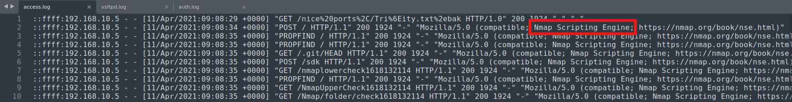
On scrolling a down a bit further, to the next section, we can see **Hydra** was used.
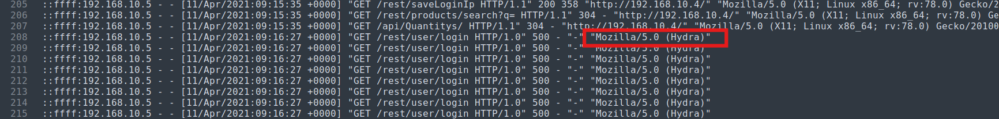
In the next section after Hydra logs, we can see **sqlmap** was also used.
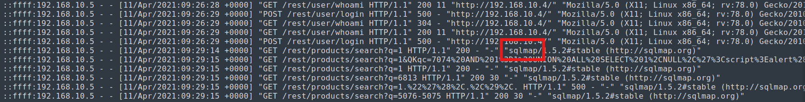
Next, on careful inspection we can see **curl** and **feroxbuster** were also used.
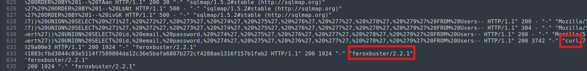
So, the answer for this question is: ***nmap,hydra,sqlmap,curl,feroxbuster***.

### 2. What endpoint was vulnerable to a brute-force attack?
For this question, we have to look at the **hydra** section in the *access.log* file, as **hydra** is used for brute forcing attacks.
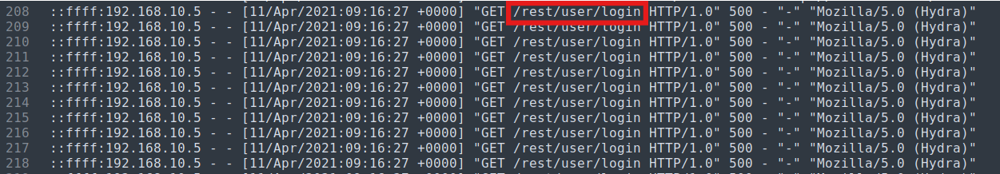
So, the answer is: ***/rest/user/login***.

### 3. What endpoint was vulnerable to SQL injection?
### 4. What parameter was used for the SQL injection?
Looking at the **sqlmap** section, we can see that ***/rest/products/search*** was targeted with parameter ***q***.
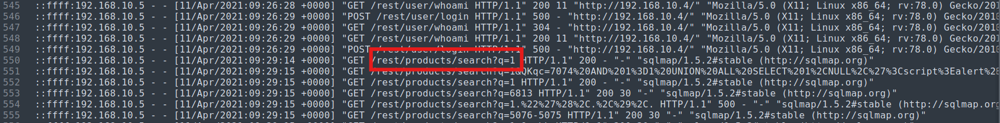

### 5. What endpoint did the attacker try to use to retrieve files?
Scroll down to the last part of the *access.log* file. Here we can see that ***/ftp*** was used to retrieve the files.
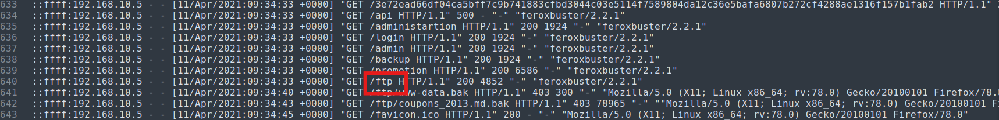

Answers:
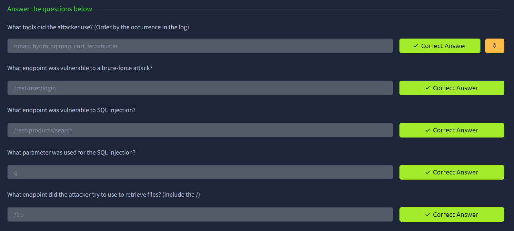

## Stolen Data
Now, moving on to the next section.

### 1. What section of the website did the attacker use to scrape user email addresses?
Attackers don’t randomly choose sections of a website. They look for places where users voluntarily expose data and where content is publicly accessible.
The review section suits the best, as it is usually unmoderated and contains high density data.
So, looking at the log files, we can see that reviews section was targeted.
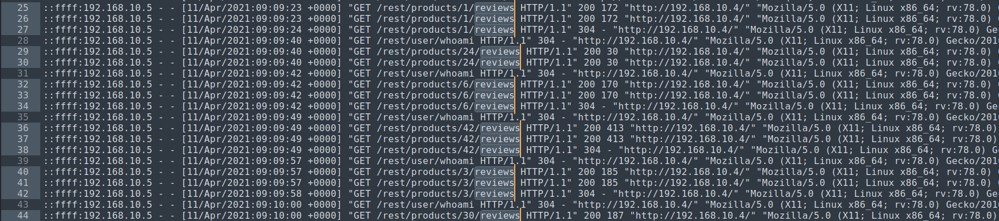
So, the answer is: ***product reviews***

### 2. Was their brute-force attack successful? If so, what is the timestamp of the successful login?
Looking at the *auth.log* file, we can see that, the attacker brute forces to gain access and is successful (it can be noticed that after a numerous failed attempts, the password is accepted and the attacker finally gains access). The timestamp can also be noted.
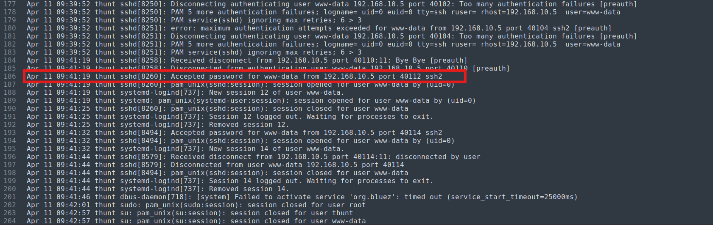
So, the answer is: ***Yay,11/Apr/2021:09:16:31 +0000***

#### 3. What user information was the attacker able to retrieve from the endpoint vulnerable to SQL injection?
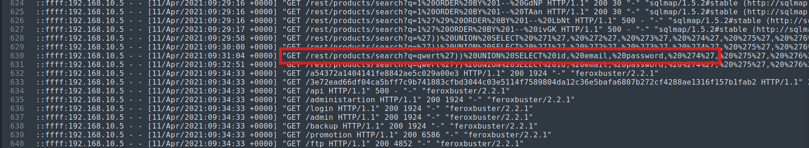
Answer: ***email, password***

### 4. What files did they try to download from the vulnerable endpoint?
For file related operations, we will have a look at the *vsftpd.log* file.

Answer: ***coupons_2013.md.bak, www-data.bak***

### 5. What service and account name were used to retrieve files from the previous question?
From the *vsftpd.log* file, we can see that the attacker uses *anonymous* account.
So, the answer: ***ftp, anonymous***

### 6. What service and username were used to gain shell access to the server?
We can clearly see that *ssh* with username: *www-data* was sused to gain shell access to the server (refer to the previously attached screenshots).
So, answer: ***ssh, www-data***

Final answers:
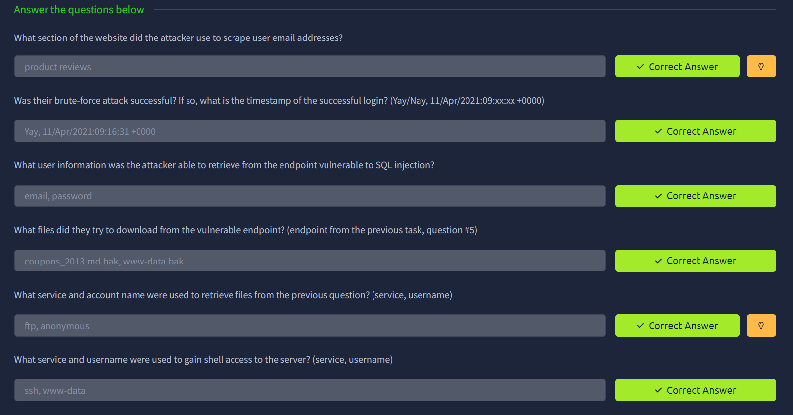
